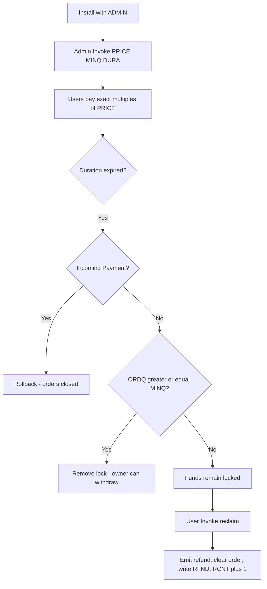

# Pre-Order Hook (POH) - Xahau HandyHook Collection

## Overview

The **Pre-Order Hook** runs a time-boxed pre-order campaign on a hook account. An admin sets the unit price, the minimum order quantity, and a duration in seconds. Users pay **exact multiples** of that price in XAH. Each payer is tracked in a unique foreign namespace. All paid funds stay locked until the campaign ends.

- If the minimum quantity is reached when the duration expires, the lock is removed and the hook owner can withdraw.
- If the minimum quantity is **not** reached, funds stay locked. Each user sends an Invoke to reclaim their payment. The user order is cleared, a refunded record is written, the locked pool is reduced, and a global refund counter is increased.

## Lifecycle



## Hook Parameters

Set at install:

| Parameter | Size | Format | Description |
|-----------|------|--------|-------------|
| `ADMIN` | 20 bytes | AccountID | Account allowed to configure the campaign |

Hex name: `41444D494E`

Convert an r-address with [raddress to AccountID](https://hooks.services/tools/raddress-to-accountid).

## Admin Invoke Parameters

All three are required on the same Invoke. Campaign start time is `ledger_last_time()` at this Invoke. End time is start + `DURA`.

| Parameter | Size | Format | Description |
|-----------|------|--------|-------------|
| `PRICE` | 8 bytes | Big-endian uint64 | Unit price in **drops** |
| `MINQ` | 8 bytes | Big-endian uint64 | Minimum total order quantity |
| `DURA` | 8 bytes | Big-endian uint64 | Duration in **seconds** |

Hex names:

| Name | Hex |
|------|-----|
| `PRICE` | `5052494345` |
| `MINQ` | `4D494E51` |
| `DURA` | `44555241` |

A campaign can be reconfigured only while **ORDQ is 0** (no outstanding orders). Once any order is recorded, parameters are frozen.

## User Payments

- Incoming **XAH only** for orders.
- Amount must be an **exact multiple** of `PRICE` (same rule as [accept_Incoming_multi.c](https://github.com/Handy4ndy/XahauHooks101)).
- Quantity credited = `drops / PRICE`.
- Repeat payments from the same account add to that account's amount and quantity. The original timestamp is kept.
- Incoming IOU payments pass through and are not counted as orders.
- Orders are rejected after the campaign window ends.

## Refunds

After expiry, if `ORDQ < MINQ`:

1. The user sends an **Invoke** to the hook account (no extra parameters).
2. The hook emits the user's paid XAH back to them.
3. User `TS`, `AMT`, and `QTY` are deleted.
4. User `RFND` is written: amount, quantity, refund timestamp.
5. Global `LOCKED` is reduced by the refunded amount.
6. Global `ORDQ` is reduced by the refunded quantity.
7. Global `RCNT` is increased by 1.

A second refund Invoke is rejected (`Order already refunded.`).

## Fund Lock

Outgoing XAH from the hook account cannot spend the locked pool.

| Campaign state | Lock behaviour |
|----------------|----------------|
| Active (before end) | `LOCKED` drops cannot leave the account |
| Success (`ORDQ >= MINQ` after end) | Lock removed (`LOCKED` set to 0) |
| Failed (`ORDQ < MINQ` after end) | Lock remains; only refund emits reduce `LOCKED` |

The emitted refund is applied after the Invoke updates `LOCKED`, so the outgoing refund payment is covered by the newly unlocked amount.

`LOCK` Invokes (1 byte) pass through for [Set Hook Lock](../Admin/Set%20Hook%20Lock/README.md).

## State

### Hook state (local)

| Key | Size | Description |
|-----|------|-------------|
| `PRICE` | 8 | Unit price in drops |
| `MINQ` | 8 | Minimum order quantity |
| `DURA` | 8 | Duration in seconds |
| `START` | 8 | Campaign start (Ripple Epoch seconds) |
| `END` | 8 | Campaign end (Ripple Epoch seconds) |
| `LOCKED` | 8 | Currently locked paid pool in drops |
| `ORDQ` | 8 | Outstanding order quantity |
| `RCNT` | 8 | Number of refunds processed |
| `STAT` | 1 | `0` active, `1` success / unlocked, `2` failed / refunds open |

### User namespace (`state_foreign`)

Namespace = 20-byte AccountID, zero-padded to 32 bytes. Owner = hook account.

| Key | Size | Description |
|-----|------|-------------|
| `TS` | 8 | First order timestamp |
| `AMT` | 8 | Total XAH paid in drops |
| `QTY` | 8 | Total quantity ordered |
| `RFND` | 24 | After refund: amount (8) + quantity (8) + refund time (8) |

## State Reserves

Each hook state key/value (local or foreign) reserves **0.2 XAH** on the hook account. That reserve is **not** part of `LOCKED`, but it still cannot leave the account until the key is deleted or the namespace is revoked.

Anyone installing this hook must keep extra XAH on the account so:

- Base account reserve is covered.
- Every campaign and user state key is covered (0.2 XAH each).
- The locked paid pool can still be refunded or withdrawn. If the spendable balance is eaten by owner-count reserve, refund emits and unlock withdrawals can fail.

### Per-user cost

| Phase | Keys | Reserve |
|-------|------|---------|
| Active order | `TS`, `AMT`, `QTY` | 0.6 XAH per payer |
| After refund | `RFND` (order keys deleted) | 0.2 XAH per payer |
| After namespace revoke | none | 0 XAH |

Local campaign keys (`PRICE`, `MINQ`, `DURA`, `START`, `END`, `LOCKED`, `ORDQ`, `RCNT`, `STAT`) also reserve 0.2 XAH each.

**Example:** 50 unique payers during an open campaign ≈ 50 × 0.6 XAH = **30 XAH** user-namespace reserve, plus local keys, plus `LOCKED`, plus the account base reserve. Fund the hook account above that total before going live.

### Reclaiming reserve after the campaign

When the campaign is finished (successful unlock, or all refunds processed), **revoke user namespaces** to delete leftover foreign state and return the 0.2 XAH per key to the hook account. Do this only after refunds are complete so order records are no longer required.

## Installation

Triggers: **Payment** and **Invoke**. Allow emitted **Payment** transactions.

```json
{
  "Account": "rHookAccount...",
  "TransactionType": "SetHook",
  "Hooks": [
    {
      "Hook": {
        "CreateCode": "<compiled wasm hex>",
        "Flags": 1,
        "HookApiVersion": 0,
        "HookNamespace": "<32-byte namespace hex>",
        "HookOn": ["PAYMENT", "INVOKE"],
        "HookCanEmit": ["PAYMENT"],
        "HookParameters": [
          {
            "HookParameter": {
              "HookParameterName": "41444D494E",
              "HookParameterValue": "<admin AccountID hex>"
            }
          }
        ]
      }
    }
  ]
}
```

## Usage Examples

### 1. Admin starts a campaign

Example: 10 XAH each, minimum 100 units, 7 days.

- `PRICE` = 10_000_000 drops = `0000000000989680`
- `MINQ` = 100 = `0000000000000064`
- `DURA` = 604800 seconds = `0000000000093A80`

```json
{
  "TransactionType": "Invoke",
  "Account": "rAdminAccount...",
  "Destination": "rHookAccount...",
  "HookParameters": [
    {
      "HookParameter": {
        "HookParameterName": "5052494345",
        "HookParameterValue": "0000000000989680"
      }
    },
    {
      "HookParameter": {
        "HookParameterName": "4D494E51",
        "HookParameterValue": "0000000000000064"
      }
    },
    {
      "HookParameter": {
        "HookParameterName": "44555241",
        "HookParameterValue": "0000000000093A80"
      }
    }
  ]
}
```

### 2. User places an order

Pay 20 XAH to buy 2 units when price is 10 XAH.

```json
{
  "TransactionType": "Payment",
  "Account": "rUserAccount...",
  "Destination": "rHookAccount...",
  "Amount": "20000000"
}
```

Valid amounts for a 10 XAH price: 10, 20, 30, ... XAH.  
Invalid: 5 XAH, 15 XAH, IOU treated as an order.

### 3. User reclaims after a failed campaign

```json
{
  "TransactionType": "Invoke",
  "Account": "rUserAccount...",
  "Destination": "rHookAccount..."
}
```

## Success Messages

| Message | Meaning |
|---------|---------|
| `POH:: Success :: Campaign configured.` | Admin setup stored |
| `POH:: Success :: Pre-order recorded.` | Payment accepted and counted |
| `POH:: Success :: Refund emitted.` | User reclaim succeeded |
| `POH:: Success :: Outgoing XAH payment.` | Withdrawal within unlocked balance |
| `POH:: Success :: Incoming IOU accepted.` | Non-XAH inbound passthrough |
| `POH:: Success :: LOCK parameter passed to Set Hook Lock.` | Locker passthrough |

## Error Messages

| Message | Cause |
|---------|-------|
| `ADMIN parameter not set at install.` | Missing install param |
| `PRICE must be 8 bytes (drops).` | Admin Invoke missing/invalid PRICE |
| `MINQ must be 8 bytes.` | Admin Invoke missing/invalid MINQ |
| `DURA must be 8 bytes (seconds).` | Admin Invoke missing/invalid DURA |
| `PRICE must be greater than zero.` | Zero price |
| `Campaign already has orders and cannot be reset.` | Reconfigure blocked |
| `Campaign is not configured.` | Orders/refunds before setup |
| `Payment must be an exact multiple of PRICE.` | Amount not `n * PRICE` |
| `Payment is less than the unit price.` | Amount below one unit |
| `Campaign duration has expired.` | Late order |
| `Campaign is closed. Orders are not accepted.` | Success or refund mode |
| `Insufficient unlocked balance.` | Outgoing XAH would spend locked funds |
| `Refunds are not available.` | Invoke before fail-state |
| `No order to refund.` | User has no paid order |
| `Order already refunded.` | Repeat reclaim |
| `Failed to emit refund.` | Emit rejected |

## Testing Notes

1. Install on testnet with `ADMIN` set.
2. Admin Invoke `PRICE`, `MINQ`, `DURA` (use a short `DURA` such as 120 seconds).
3. Pay a non-multiple → rejected.
4. Pay `1 * PRICE` and `2 * PRICE` from the same account → `QTY` becomes 3, `AMT` sums.
5. Confirm `LOCKED` and `ORDQ` on the hook account.
6. Attempt an outgoing XAH payment during the window → rejected if it exceeds unlocked funds.
7. **Success path:** meet `MINQ` before expiry, wait, then withdraw from the hook account.
8. **Fail path:** miss `MINQ`, wait, each user Invoke, confirm `RFND` in their namespace and `RCNT` on the hook.

Use [Xahau Hooks Builder](https://builder.xahau.network/develop) and [Hex visualizer](https://transia-rnd.github.io/xrpl-hex-visualizer/).

## Access Control

- **Admin only** can start or reset a campaign (reset only if `ORDQ == 0`).
- **Any account** may order by paying the hook account during the window.
- **The original payer** can reclaim after a failed campaign.
- **Hook owner** may withdraw unlocked XAH after a successful campaign.
