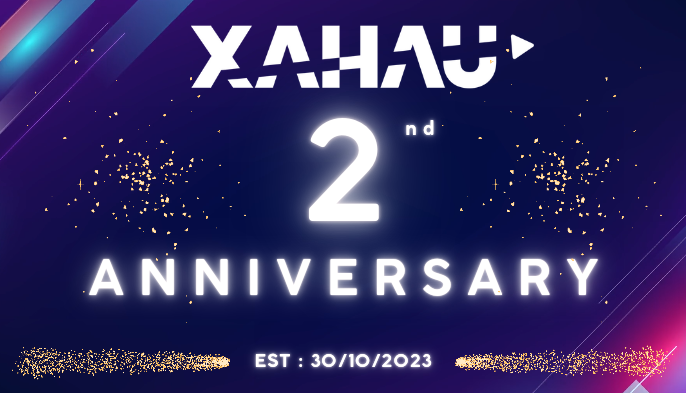

# 🎂 How to Send a Birthday Message to Xahau's Second Anniversary Card 🎉

<p align="center">
  
</p>

Let’s make Xahau’s 2nd birthday unforgettable!  
Add your wish to the on-chain birthday card in just a few fun steps.

---

## ✍️ 1. Write Your Message

Type your birthday wish for Xahau!  
_Example:_  
```
Happy 2nd Birthday, Xahau! 🎉
```

---

## 🧙 2. Convert Your Message to HEX

Use the [XRPL HEX Visualizer](https://transia-rnd.github.io/xrpl-hex-visualizer/):

- Paste your message into the **Text** field.
- Copy the HEX string from the **Hex** field.

---

## 📝 3. Prepare Your Transaction

Fill in the template below:

- Replace `YOUR_rADDRESS_HERE` with your Xahau address.
- Replace `MESSAGE_HEX_STRING_HERE` with your HEX string.

```json
{
  "TransactionType": "Invoke",
  "Account": "YOUR_rADDRESS_HERE",
  "Destination": "rGe24P5aZckhpfsXSsSwRa68pgtaio4yZw",
  "HookParameters": [
    {
      "HookParameter": {
        "HookParameterName": "4D5347",
        "HookParameterValue": "MESSAGE_HEX_STRING_HERE"
      }
    }
  ],
  "NetworkID": 21337
}
```

---

## 🚀 4. Submit Your Message

1. Go to [XRPL Win Raw Transaction Sender](https://xahau.xrplwin.com/tools/tx/raw).
2. Paste your filled-out JSON into the transaction field.
3. Sign in and submit using your wallet.

---

## 🎊 5. Celebrate!

Your message is now part of Xahau’s on-chain birthday card!  
See your wish (and others) in the [Namespace Explorer](https://xahau.xrplwin.com/account/rGe24P5aZckhpfsXSsSwRa68pgtaio4yZw/namespaces/FBE697429F16141BC71E3B91F3823641C8DD258DD58BF076241514754954CB8C).

---

**Happy Birthday, Xahau! Let’s fill the chain with joy! 🥳**
